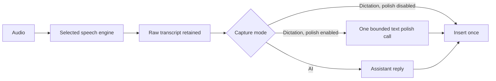

# Odicto adversarial review — 30 September 2026

## Decision

Repair the F7 insertion/finalization lifecycle and make AI failures visible before attempting a language rewrite. There is unnecessary coordination in the live path, but the single-instance lock, platform adapters, persistent microphone stream, lazy model loading, and speech/assistant separation serve real requirements. Removing them would make the app less reliable.

This pass reviewed the **current working tree**, based on commit `6f1d17d` on `main`, including the 12 files already modified when the review began. Those edits were preserved. No production code, configuration, provider credentials, running process, or hotkey was changed. This document proposes changes; it does not claim the defects are fixed.

## What was verified

| Check | Result | Limit |
|---|---|---|
| `tools/verify.ps1 -SkipCleanEnv` | PASS: 156 unit tests, 15 equivalence tests, zero skips in those suites; imports and macOS/Linux syntax checks pass | Windows only; the script's separate file-moving clean-env gate was SKIPPED |
| Ten additional offline probes | REPRODUCED: the observed defects described below | Mocked clipboard/keyboard/audio; no authenticated provider calls |
| Gemini image payload | FAIL against installed SDK request schema; corrected typed content objects validate | No network request sent |
| Actual browser/editor clipboard consumption | NOT CHECKED | The delayed consumer is a deterministic model of an asynchronous application |
| Real AI provider/model response | NOT CHECKED | The operator's `.env` was neither read nor exposed |
| macOS/Linux permissions, hooks, paste and microphone | NOT CHECKED | Syntax and mocked unit tests are insufficient |
| CPU, RAM, VRAM, energy and end-to-end latency | NOT BENCHMARKED | No model was loaded or downloaded for this review |

The test subprocesses used a task-owned `sitecustomize.py` that clears known configuration variables, disables dotenv loading, returns an empty mapping for the install's live `.env`, and rejects opening that file. Temporary `.env` fixtures in the tests still work. This is an isolated-default run, not a check of the user's configuration. The standard suite can pass while the defects below remain: its mocks do not model delayed paste consumption, real bound-method removal, or the complete Interactions image schema.

## Findings, ordered by impact

### 1. P1 — F7 can paste old clipboard contents after stop

**Evidence:** `typer.py:262-318`, especially the 15 ms settle for live paste at line 309; `main.py:416-428`, `1102-1137`.

Long live edits use clipboard paste. Injecting a paste chord queues input; the target application can read the clipboard later. After finalization, Odicto restores the original clipboard. A consumer delayed beyond that restoration reads old copied text instead of the transcript. `_CLIPBOARD_LOCK` serializes Odicto's writes; it cannot serialize a browser's later read. `_flush_live_caret` only compares internal strings and cannot confirm delivery; it returns silently on timeout.

**Probe:** queue a fake paste consumer, restore `OLD COPIED TEXT`, then consume the queued paste. The consumer receives `OLD COPIED TEXT`. This matches the reported symptom and proves a possible ordering; reproducing it in the user's actual target application remains necessary.

**Repair:** make insertion report failure and keep finalization active until the insertion worker has finished. Avoid automatic clipboard restoration before a pending consumer can read its payload. A fixed longer sleep is mitigation, not a proof. The simplest product design is live preview in Odicto's HUD and one final insertion at stop. If in-document streaming must remain, use an explicit target and serialized insertion ownership, with platform-specific delivery and conservative restoration. Choose that UX deliberately; do not silently replace it during a refactor.

### 2. P1 — F7 announces idle before finalization and can overlap a new AI capture

**Evidence:** `main.py:1065-1076`, `839-885`, `1102-1137`.

When interim text exists, stop marks success and IDLE while cleanup still waits for the authoritative final and edits the document. A new F7 press checks `_live_cleanup_done`, but the ordinary and AI chords do not. A new ordinary/AI capture does not increment `_live_epoch`, so the old cleanup still passes its epoch check, commits old text during that recording, restores the clipboard, and clears shared recorder state. The old final can arrive after the user has started typing or moved the caret.

**Probe:** clear the cleanup event, leave the app IDLE, call `on_press(use_llm=True)`, then run old cleanup. A new recording starts and old text is committed during RECORDING.

**Repair:** RECORDING → PROCESSING/FINALIZING → IDLE must cover the full live stop and insertion, for every entry chord. Use one capture/session identity for all captures. Do not hold `state_lock` while waiting for a worker that needs it. Return a visible “finalizing” state rather than premature success.

### 3. P1 — late live callbacks and caret edits have no effective ownership fence

**Evidence:** `main.py:341-396`, `1042-1045`; `transcriber.py:662-675`; `typer.py:321-350`.

Callbacks are bound directly to mutable app state; they carry no epoch. A stopped session can outlive the four-second join timeout. Its callback can then append to a later active session. The caret worker checks its epoch only **after** sending input. It also has no target-window/caret ownership check; common-prefix backspaces assume that nobody has moved or edited the caret.

**Probe:** retain an old final callback, activate new-session state, then invoke that callback. `OLD SESSION FINAL` is appended to `NEW SESSION`.

**Repair:** bind session identity into callbacks and validate it before scheduling or performing edits. Retain ownership until stop is complete, and cancel/reject old work. On focus/selection change, stop automatic replacement and retain the final text in the HUD for explicit insertion. Moving the live preview into the HUD removes most of this complexity.

### 4. P2 — Gemini AI image requests use the wrong schema

**Evidence:** `refiner.py:738-758`.

The AI image branch creates `google.genai.types.Part` and sends `[part, user_message]` to the Interactions API. Its installed request model expects typed Interactions content, not GenerateContent parts mixed with a plain string. An image present on the clipboard can therefore turn a working text-only AI request into an exception and raw-transcript fallback.

**Probe:** the installed `CreateModelInteraction` model rejects the current list. An `image` object with base64 `data`/`mime_type` and a `text` object validate. Google's [Interactions image example](https://ai.google.dev/gemini-api/docs/image-understanding#passing-inline-image-data) uses that shape.

**Repair:** use the Interactions content shape and test its request serialization with the real SDK schema. Marshal the Qt clipboard-image read onto the GUI thread rather than calling GUI objects from the selection executor (`typer.py:359-386`); see [Qt's thread rules](https://doc.qt.io/qt-6/threads-qobject.html). Make image context explicit so an old clipboard screenshot does not unexpectedly accompany an unrelated spoken instruction.

### 5. P2 — AI failure is reported as successful dictation

**Evidence:** `refiner.py:672-683`, `807-860`; `main.py:1269-1296`.

Missing clients, exceptions and empty responses deliberately return the raw transcript. The caller cannot distinguish that fallback from a model reply, so it pastes the spoken instruction and marks success. This explains the observed behavior without proving which provider error caused a particular occurrence. Some provider tests also accept empty output as a successful ping.

**Probe:** make the chat client raise a timeout. The pipeline pastes the original question and sets `last_status="success"`.

**Repair:** carry a small explicit outcome (text, fallback/error category) to the HUD. Preserve the words, but display “AI unavailable — raw transcript used.” A bounded, intentional transient retry can help; do not retry permanent authentication/model errors. Expose the error category without key material. Test that the setup test actually obtains usable assistant text.

### 6. P2 — stopped live sessions retain audio listeners

**Evidence:** `recorder.py:191-199`; `main.py:985`, `1048`.

`remove_chunk_listener` uses `is not fn`. Each evaluation of `session.push_audio` produces a distinct bound-method object. The remove call therefore retains the listener registered by the add call, retaining stopped session/client references and increasing callback work over repeated F7 sessions. The existing unit test removes the exact stored object and misses the production case.

**Probe:** add and remove the same instance's bound method using two attribute accesses. One listener remains.

**Repair:** compare callbacks by equality or retain and remove the exact registered callback. Add a lifecycle regression that uses the actual add/remove calling pattern.

### 7. P2 — non-Gemini F7 provider overrides are ignored

**Evidence:** `config.py:742-757`; `main.py:469-475`, `1041-1055`, `1091-1099`, `429-437`.

Initialization creates one transcriber from `STT_PROVIDER`. F7 only creates a separate engine for Gemini Live. Every non-Gemini batch path calls the same existing transcriber. Thus `STT_PROVIDER=groq` and `LIVE_STT_PROVIDER=whisper` still send F7 audio to Groq; the inverse can also occur. The setup page exposes choices that runtime does not honor.

**Probe:** resolve the live choice to Whisper while the app has a Groq transcriber. The pipeline invokes Groq.

**Repair:** honor the resolved live engine through a small cached factory, or deliberately remove the redundant override and make F7 use the selected speech engine. The latter is simpler but changes an exposed feature and requires a documented migration.

### 8. P2 — microphone ring compares samples with bytes

**Evidence:** `recorder.py:49`, `129-134`.

`ring_len` counts samples, while `_ring_bytes` is four times the intended mono float32 sample count. The five-second ring retains approximately twenty seconds and rescans the list each callback.

**Probe:** 16 kHz mono, 1024-frame chunks: 312 retained chunks, 19.968 seconds instead of five. That is about 1.22 MiB of sample data instead of 0.31 MiB; this is a small measurable waste, not a large-memory explanation by itself.

**Repair:** maintain a sample counter and a deque, bounded in frames consistently for stereo too. Keep the short pre-roll; it prevents clipped initial speech. Separately, Gemini Live registers after recorder start and receives only subsequent chunks, so it does not currently receive the recorder's seeded pre-roll.

### 9. P2 — Windows native injection has the wrong INPUT size

**Evidence:** `platforms/_keyboard.py:375-418`, `427-477`.

Both native text and backspace paths define a union containing only `KEYBDINPUT`. The complete Win32 INPUT union includes MOUSEINPUT and HARDWAREINPUT. The current x64 structure is 32 bytes rather than 40, so SendInput's size contract is violated and the supposedly fast native path falls back.

**Probe:** replace SendInput with a recording mock. Native text sends `cbSize=32`; a complete ABI layout requires 40 on this interpreter. No real input was sent. Microsoft documents the [INPUT layout](https://learn.microsoft.com/en-us/windows/win32/api/winuser/ns-winuser-input) and [size requirement](https://learn.microsoft.com/en-us/windows/win32/api/winuser/nf-winuser-sendinput).

**Repair:** one correct shared declaration of the Win32 ABI; test sizes and partial insertion accounting. Do not retry an entire partially delivered text or deletion batch, which can duplicate already delivered input.

### 10. P2 — slow fallback and startup policies conflict with easy portability

**Evidence:** `transcriber.py:105-181`, `232-281`, `453-460`, `565-569`.

Any auto-selected model larger than tiny/base waits up to five minutes for CUDA even on hardware that has no supported NVIDIA device, then attempts CUDA anyway. This runs before hotkeys become ready for local STT and can run on the first cloud failure. Cloud speech calls allow 45 seconds before local fallback; assistant calls allow 90 seconds for OpenRouter and 120 seconds for Meta, with additional empty-answer retries. Gemini calls have no application-owned deadline at their call sites.

**Repair:** distinguish absent/unsupported hardware from a temporarily unavailable known CUDA device. Use CPU immediately on unsupported systems; make prolonged GPU waiting an explicit opt-in policy. Bound cloud stages with user-visible deadlines. Keep cloud-only Whisper lazy, and label the first fallback model load/download rather than claiming instant recovery.

### 11. P2 — arbitrary sample rates are accepted but local array transcription assumes 16 kHz

**Evidence:** `config.py:1232-1235`; `transcriber.py:329-371`; `recorder.py:66-78`.

Validation permits any positive sample rate, and capture uses it. The local in-memory path passes the resulting array directly to faster-whisper without resampling. Unlike the WAV path, the array carries no sample-rate metadata. Non-16-kHz settings can corrupt timing and recognition.

**Repair:** enforce 16 kHz for the current pipeline or resample once at its boundary. This is a correctness fix before optimizing the recorder language.

## What to simplify, retain, and measure

Current production Python totals **9,382 lines**, excluding tests, tools and installers; setup markup adds 2,734 lines. Lines alone do not prove overengineering. `docs/engineering-notes.md` correctly distinguishes prior relocation of HTML from real deletion.

| Candidate | Recommendation |
|---|---|
| Mutable F7 draft/current/desired strings, cleanup branches, clipboard snapshots, caret worker | Highest-value simplification: one session owns a preview, a final result, and one serialized commit |
| Unused live `_loop`, `_ready` event (set but never awaited), `_session` field (written but not read); unused `capture_ai_context` import in main | Remove after reference search and lifecycle tests; small savings, not a performance breakthrough |
| Fixed temp WAV fallback and cleanup in an otherwise in-memory pipeline | Remove only after proving no supported caller depends on it; tests still exercise pre-transcript paths |
| Separate generic/provider config tiers and import-time snapshots | Avoid adding new tiers. Keep compatibility now; simplify later through an explicit deprecation/migration rather than invalidating saved config or mocks |
| Provider metadata duplicated across config, setup and clients | Share only uniform facts: names, credential key and model setting. Keep protocol-specific requests explicit; a large plugin/provider framework would add complexity |
| Automatic remote LLM boot pings | Remove automatic remote inference warmup; connection reuse is useful, boot generations are not local model loading. Keep explicit setup testing and bounded optional Ollama warmup |
| Qt HUD | Already pauses its animation timer when hidden (`indicator.py:527-541`). Do not claim an idle 60 FPS CPU leak. Consider 30 FPS while visible only after measuring |
| Single-instance lock and hook teardown | Retain and strengthen. They protect normal typing across every app |
| Persistent mic, bounded pre-roll, lazy imports, int8 CPU tiny/base | Retain; they directly support responsiveness and hardware economy |

Also replace synchronous unbounded `SendMessageW(WM_COPY)` selection probing with a bounded operation (`platforms/_keyboard.py:183-200`). The selection future timeout does not cancel a stuck native call, so repeated captures can accumulate workers. Clipboard snapshots currently preserve text only: restoring after probing a bitmap can discard the bitmap. These are further code-inspection findings; they were not exercised with a real GUI in this pass.

## Optional transcript polish and Groq

**Existing:** Groq speech transcription with a custom `GROQ_STT_MODEL`; independent speech and assistant providers; Gemini SMART transcription. **Missing:** direct Groq assistant/chat provider and a general opt-in post-transcription polish stage. The existing `TextRefiner.refine` answers the spoken request; its system prompt explicitly says not to polish dictation. It must not be reused unchanged for cleanup.

The desired flow is small:



Add direct Groq chat through the existing OpenAI-compatible client surface, reusing the saved Groq credential. Expose a model field; users should select from models available to their account rather than hardcoding a permanently “best” model. Groq's [speech documentation](https://console.groq.com/docs/speech-to-text) distinguishes `whisper-large-v3` from the faster `whisper-large-v3-turbo`; its [model catalog](https://console.groq.com/docs/models) separately lists chat models and account availability. Speech-model choice is not chat-model choice. Advertised generation throughput is not end-to-end latency.

For a first implementation, reuse the selected assistant provider and credential, with two additional user-facing controls: **Polish dictation** (off by default) and an optional **polish model** override. Use a separate fixed cleanup instruction and no assistant history, selection/image context, reset phrases, or tools. Do not make a second speech call. Local Whisper + cloud Groq text polish is a valid combination and avoids loading a local LLM.

The call should preserve meaning, language, names, numbers and identifiers; return only the edited transcript. Aim for a roughly two-second total deadline as an initial product budget, then tune from measurements. Reuse the client connection; do not run parallel polish requests or unbounded retries. On timeout, empty output, truncation, or error, insert the retained raw transcript once with a visible fallback notice. Do not silently truncate long input/output to fit an arbitrary token cap. Grammar edits can change meaning; prompts alone cannot guarantee preservation, so test multilingual text, names, technical tokens, dictated commands and long passages.

For Gemini SMART, skip extra polish by default: Google already documents grammar, casing, punctuation and structured formatting in the authoritative final. The fix is to commit that final correctly, not transcribe the clip again. See [Gemini Live transcription](https://ai.google.dev/gemini-api/docs/live-api/live-transcribe).

## Python, Go, or Rust

Keep Python for the repair pass. Local speech inference already runs through native CTranslate2, and NumPy handles the main audio operations natively. A new orchestration language does not shrink model weights, network RTT, output-token generation, or CUDA allocations. The [faster-whisper project's benchmarks](https://github.com/SYSTRAN/faster-whisper#benchmark) demonstrate that inference engine, quantization and batching matter; they are not measurements of Odicto or proof that one engine wins on every device.

| Option | Potential gain | Cost and recommendation |
|---|---|---|
| Current Python + targeted repairs | Lowest disruption; preserves current engine and OS adapters | Recommended first. Measure runtime overhead instead of inferring it from source length |
| Python + optional `whisper.cpp` engine | Access to quantization, Metal/Core ML on Apple Silicon, and other native backends | Benchmark a narrow backend prototype before considering an app rewrite |
| Rust host + native STT | Opportunity for smaller host runtime, explicit ownership, native distribution | Prefer over Go if measured host/packaging needs justify a rewrite. Clipboard delivery and permissions still require platform work; memory safety does not prove correct UI ordering |
| Go host + native STT | Simple networking/concurrency and compiled deployment | Viable, but native audio/STT/UI integration still adds bindings and OS-specific dependencies. No demonstrated GPU or STT benefit from language choice alone |

[whisper.cpp](https://github.com/ggml-org/whisper.cpp) supports Windows, macOS and Linux, including Apple acceleration and quantized models. It can be integrated from Python too. A switch of STT backend therefore does not require a simultaneous rewrite of hooks, setup, HUD and lifecycle management. A webview-based desktop shell also has memory cost; do not assume any Rust/Go UI choice is automatically lighter than Qt.

Measure idle RSS/private memory, idle CPU/energy, cold startup-to-ready, first/warm recording latency, audio allocation peak, and stop-to-final-insertion p50/p95. Separate STT, assistant/polish, finalization and insertion time. Use the same recorded corpus and model/accuracy targets across candidates. Run cloud calls only in an explicitly authorized benchmark. Avoid a second agent instance or stacked hooks while measuring the live app.

## Cross-platform completion criteria

Windows currently has the strongest local verification, but this pass did not exercise actual keyboard injection. macOS requires real Accessibility/Input Monitoring tests, native terminal detection and clipboard image handling. Linux's existing keyboard backend and X11 helpers are insufficient evidence of usable Wayland support. The shell installer also lacks native Linux PortAudio/clipboard dependency checks even though CI installs those libraries.

For Wayland, evaluate compositor-supported [GlobalShortcuts](https://flatpak.github.io/xdg-desktop-portal/docs/doc-org.freedesktop.portal.GlobalShortcuts.html) and separately a permitted [RemoteDesktop/EIS input path](https://flatpak.github.io/xdg-desktop-portal/docs/doc-org.freedesktop.portal.RemoteDesktop.html), or provide preview/copy/manual insertion when unsupported. Global shortcuts alone do not grant text injection. Running the entire dictation application as root is not an “easy on every Linux desktop” solution. Language migration does not change that platform boundary.

Acceptance requires actual microphone, hotkey press/release, target insertion, failure fallback and normal typing after shutdown on Windows, macOS Intel/Apple Silicon as available, Linux X11 and representative Wayland compositors. The CI matrix is useful but cannot grant GUI permissions or reproduce target-app behavior on its own.

## Recommended order and retained evidence

1. Fix insertion delivery/status, Gemini image schema, listener removal and finalization ownership; add focused regression coverage before broader deletion.
2. Choose F7 preview/commit semantics, then simplify the live state machine around that choice.
3. Add direct Groq chat and opt-in text polish through the existing transport, with an independent prompt and short budget.
4. Repair non-CUDA startup, audio units/rates, Win32 ABI, and OS capability/setup checks.
5. Measure the repaired application; prototype an alternate inference backend only where the results justify it. Decide on a native host afterward.

The offline probes, isolation bootstrap, JSON findings and verification output are retained under `.commandcode/adversarial-review-20260930/` (gitignored). They contain synthetic text and no credentials. To rerun on Windows from the repository root:

```powershell
$env:PYTHONPATH = (Join-Path (Get-Location) '.commandcode/adversarial-review-20260930') + ';' + (Get-Location).Path
.\.venv\Scripts\python.exe .commandcode/adversarial-review-20260930/probes.py
powershell -NoProfile -ExecutionPolicy Bypass -File .\tools\verify.ps1 -SkipCleanEnv
Remove-Item Env:PYTHONPATH
```

These probes assert that defects exist; successful reproduction is **not** a passing regression suite for a future fix. Convert them into desired-behavior assertions during repair. They are local evidence rather than shipped application code. Once that coverage exists, remove only this task-owned evidence directory if no longer needed. This review did not alter the pre-existing working-tree changes or delete unrelated files.

## Implementation follow-through

Implemented after approval: one final F7 insertion with HUD previews, PROCESSING
ownership, epoch callbacks and retained final clipboard payload; visible AI/raw
fallback; valid Gemini image payloads and explicit GUI-thread screenshot capture;
bound-listener removal, five-second frame ring and live pre-roll delivery; correct
Windows INPUT sizing and fail-closed partial input; bounded WM_COPY/CUDA probing,
16kHz validation and removal of paid startup generations; direct Groq chat and
independent optional two-second polish. The live caret editor and unused session
fields were deleted. No Rust/Go rewrite or new runtime dependency was introduced.

Verification is recorded in `.commandcode/build-verify.txt`. Provider responses and
physical microphone/keyboard behavior on Windows/macOS/Linux still require live
testing; this build's tests use isolated configuration, mock providers and no hooks.
