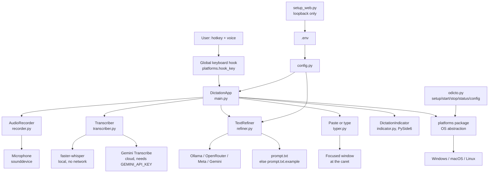
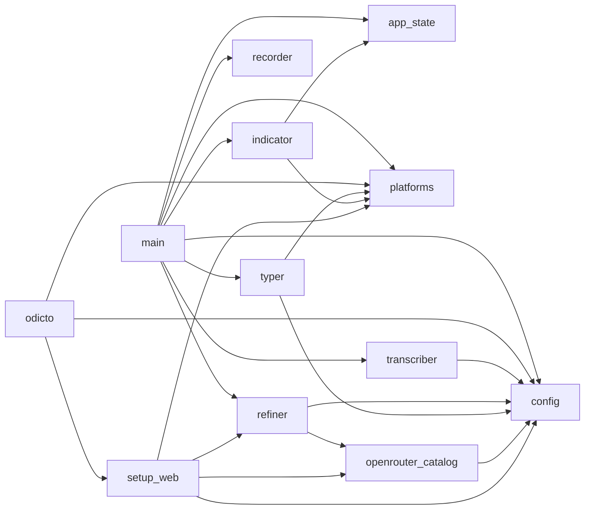
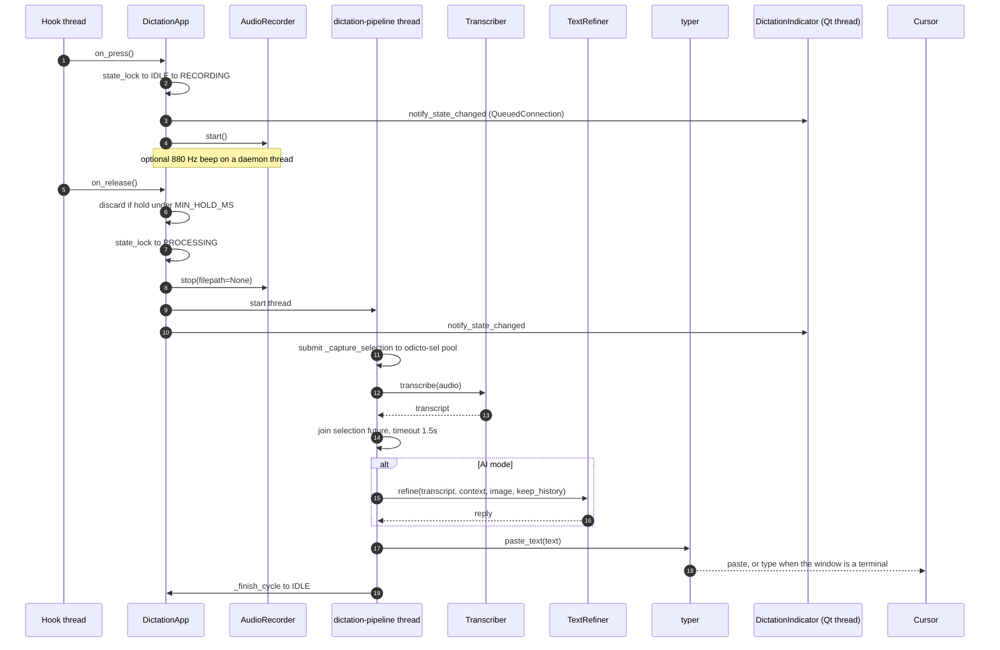
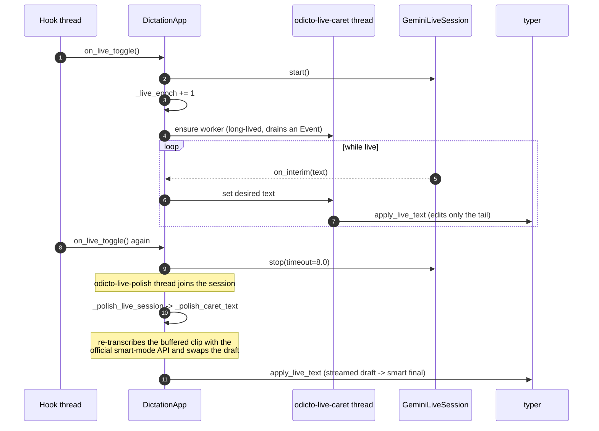
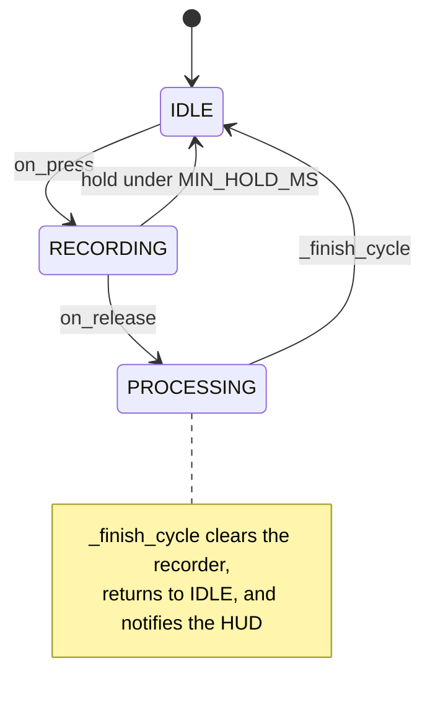
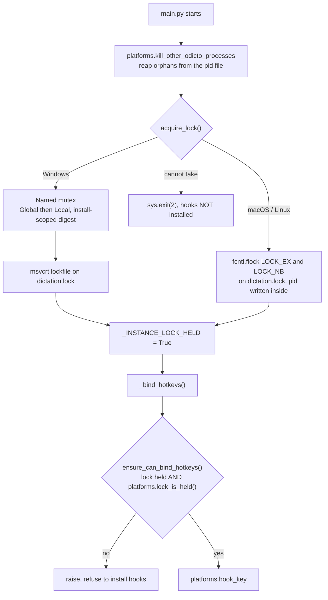
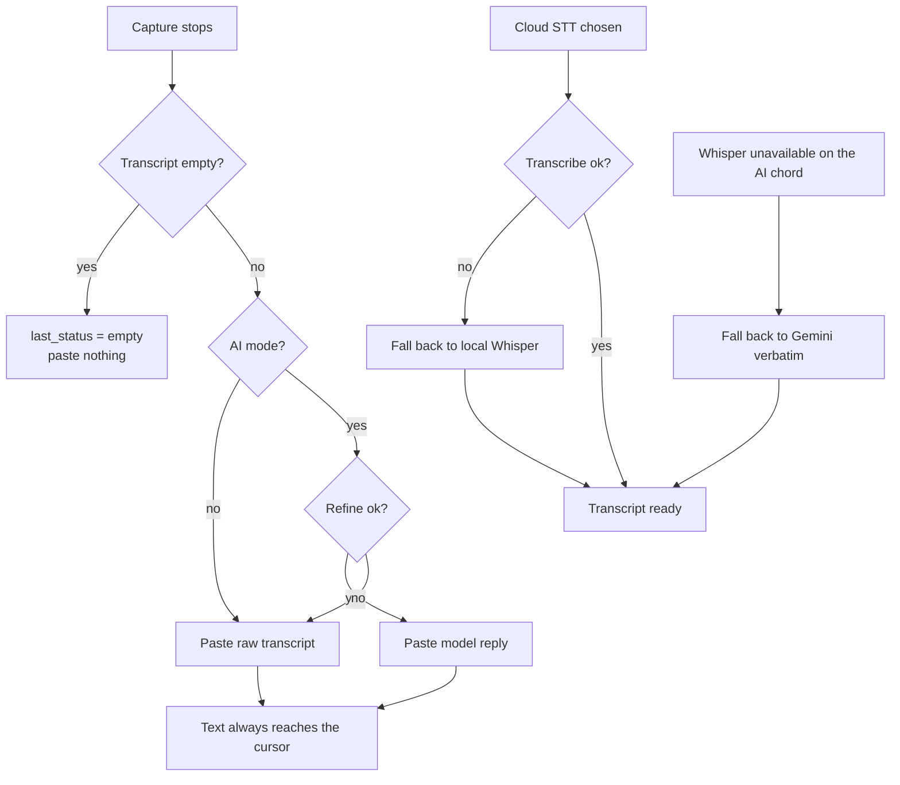

# Odicto — Architecture

**This file is the canonical architecture reference.** `README.md` and `AGENTS.md` link here
rather than repeating it. If you are an agent or a new contributor, read this first, then
[engineering-notes.md](./engineering-notes.md) for why things are shaped this way.

Odicto is a **push-to-talk dictation tool with optional AI reframing**. You hold (or tap) a
global hotkey, speak, release, and the text is pasted at your cursor. With a second hotkey the
transcript is first sent to an LLM as a prompt, and the model's reply is pasted instead.

---

## 1. The 60-second tour

| Question | Answer |
|---|---|
| Entry point | `main.py` (the app), `odicto.py` (lifecycle CLI), `setup_web.py` (setup page) |
| How it starts | `start_dictation.bat` / `run_debug.sh` → `main.py` (pythonw on Windows) |
| Where config comes from | `.env` → `ENV_DEFAULTS` in `config.py` (single source of defaults) |
| How text reaches your cursor | `typer.py` — clipboard paste, or **typing** when the target is a terminal |
| Speech to text | `transcriber.py` — local Whisper, or cloud Gemini Transcribe |
| Optional LLM | `refiner.py` — `none` / `ollama` / `openrouter` / `meta` / `gemini` |
| Audio capture | `recorder.py` — a persistent `sounddevice` stream + 1.5 s pre-roll |
| The bit that bites you | a **global keyboard hook with suppression**, hence the single-instance lock |

**How to run it locally**

```bash
.\run_debug.bat            # Windows: foreground, console logging
./run_debug.sh             # macOS / Linux
.\setup.bat                # configure a provider + API key in a web form
.venv\Scripts\python.exe odicto.py config   # show every resolved value and its source
```

---

## 2. System context



---

## 3. Module map

Production Python is **9,031 lines** (was 10,623 before the consolidation experiment).
`setup_template.html` (1,564 lines) holds the setup page markup that used to be an f-string
inside `setup_web.py`.

| Module | Lines | Responsibility | Public API other modules call |
|---|---|---|---|
| `main.py` | 1,375 | Process entry, orchestration, `DictationApp` state machine, hotkey handlers, pipeline | `DictationApp`, `acquire/release_single_instance_lock`, `ensure_can_bind_hotkeys` |
| `config.py` | 1,277 | `.env` loading, `ENV_DEFAULTS`, cascade resolvers, validation, hotkey parsing, prompt resolution | `Config`, `ENV_DEFAULTS`, `parse_hold_hotkey`, `validate_hotkey_pair`, `config_warnings`, `prompt_live_path` |
| `indicator.py` | 1,008 | PySide6 always-on-top, click-through HUD: glyph, label, chips, waveform, 60 fps ticks | `DictationIndicator`, `GuiState`, `status_label` |
| `refiner.py` | 951 | LLM clients and the refine call, conversation history, provider ping | `TextRefiner`, `test_provider`, `openrouter_effort_for_model`, `build_system_prompt_with_context` |
| `setup_web.py` | 877 | Loopback setup page server; reads/writes `.env` and `prompt.txt` atomically | `run_server`, `_page`, `merge_env`, `validate_provider_requirements` |
| `transcriber.py` | 614 | Whisper + Gemini unary + Gemini Live streaming sessions | `WhisperTranscriber`, `GeminiTranscriber`, `GeminiLiveSession`, `float32_to_wav_bytes` |
| `typer.py` | 402 | Clipboard snapshot/restore, paste chords, terminal typing, selection probe | `paste_text`, `get_selected_text`, `apply_live_text`, `capture_ai_context` |
| `recorder.py` | 325 | Persistent capture stream, pre-roll, level/waveform, beeps | `AudioRecorder`, `play_beep` |
| `openrouter_catalog.py` | 254 | Cached OpenRouter model catalog; reasoning-effort clamping | `ensure_openrouter_catalog`, `clamp_openrouter_effort`, `lightest_openrouter_effort` |
| `odicto.py` | 206 | Lifecycle CLI (`setup`/`start`/`stop`/`status`/`config`/`autostart`) | `main()` |
| `app_state.py` | 15 | The shared `AppState` enum, in its own module so `main` and `indicator` compare the *same* class | `AppState` |
| `platforms/` | 1,727 | Per-OS keyboard, clipboard, window, lock and process behaviour | see §3.1 |

### 3.1 The platform layer

`platforms/__init__.py` picks a backend **once at import** and re-exports it, so `import
platforms` gives one consistent surface on every OS.

| File | Lines | Role |
|---|---|---|
| `platforms/__init__.py` | 51 | `sys.platform` dispatch + `__all__` |
| `platforms/base.py` | 168 | OS-agnostic: install paths, clipboard, terminal-detection tables and matcher |
| `platforms/_keyboard.py` | 481 | Shared `keyboard`-lib backend (Windows + Linux): hooks, key synthesis, SendInput batching |
| `platforms/_posix.py` | 228 | Shared POSIX lock (`fcntl.flock`) and process management |
| `platforms/windows.py` | 353 | Named mutex + `msvcrt` lockfile, `taskkill` orphan sweep, Win32 exstyles |
| `platforms/macos.py` | 352 | `pynput` hooks, `NSWorkspace` terminal detection |
| `platforms/linux.py` | 94 | X11 terminal detection via `xdotool`/`xprop`; re-exports the POSIX helpers |

### 3.2 Module dependency graph (generated)

Regenerate with `python tools/module_graph.py --write`; `--check` fails when stale, and
`test_equivalence.py` runs that check.

<!-- BEGIN GENERATED: module-graph (tools/module_graph.py) -->

<!-- END GENERATED: module-graph -->

Two things worth noticing: `config` is imported by nearly everything (it is the only place
defaults live), and `platforms` is imported by `typer` and `indicator` as well as `main` —
which is why the platform `__all__` lists must cover their needs too, not just `main`'s.

---

## 4. The critical path: hold the hotkey, speak, release



The selection/image probe overlaps transcription on purpose: clipboard waits must not delay
STT.

## 5. The live path (F7 tap-to-talk)



**Epoch guard.** Every live callback carries `_live_epoch`. If a stale worker finishes after
you already started a new session, it must not touch the new one — that is why
`_cleanup_live_session` deliberately does *not* call `_finish_cycle()` for a stale epoch.

**Smart final (`LIVE_POLISH`, default true).** The streamed draft is raw ASR. On stop,
`_polish_live_session` re-transcribes the buffered clip through the official unary
transcribe API (`GeminiTranscriber`, honoring `GEMINI_TRANSCRIBE_MODE`) and swaps the
caret draft for that result in place via `apply_live_text`. If polish fails or yields
nothing, the streamed draft is kept as-is; `LIVE_POLISH=false` skips the swap entirely
(`_cleanup_live_session` keep-text path). Both stop threads run off the hook thread —
`session.stop()` is never called there.

## 6. Application and HUD states



`AppState` (main) drives `GuiState` (indicator). The HUD polls the app on a 60 fps tick and
maps state plus `last_status` into `BOOTING / RECORDING / PROCESSING / SUCCESS / ERROR /
RESET / HIDDEN`. Auto-hide timers: 1.2 s on success, 1.5 s on error.

## 7. Single instance — the invariant that keeps typing sane

While Odicto runs, **every keypress in every app** passes through its global hook. Two
instances means two hooks and doubled characters (`tthhiiss`). Three gates enforce one
instance:



**Never install hooks without the lock.** On Windows the same install-scoped name is used,
so a second copy in the same folder collides while a second *different* install does not.

## 8. Threads and locks

| Thread | Created by | Lives for | Notes |
|---|---|---|---|
| `dictation-init` | `DictationApp.__init__` | start-up only | builds recorder/transcriber/refiner, binds hotkeys |
| hook thread | `platforms.hook_key` | process | invokes `on_press` / `on_release` / `on_live_toggle` |
| `dictation-pipeline` | `on_release` | one cycle | `process_and_paste` |
| `odicto-sel` | `process_and_paste` | one cycle | `ThreadPoolExecutor(max_workers=1)`, shut down in `finally` |
| `odicto-live-caret` | `_ensure_live_caret_worker` | process | long-lived, drains `_live_caret_event` |
| `odicto-live-stop` / `-cleanup` / `-abort` | live teardown | one task | join the session off the hook thread |
| `beep-start` / `beep-stop` | `DictationApp._beep` | ~80 ms | never blocks the hot path |
| `odicto-whisper-warm` | `initialize_app` | start-up only | warms Whisper for the AI chord |
| Qt thread | `indicator.start` | process | all painting; worker threads marshal via signals |

| Lock / primitive | Guards |
|---|---|
| `self.state_lock` | `state`, `_last_cycle_end`, `_record_started_at` |
| `self._live_caret_lock` | `_live_caret_current`, `_live_caret_desired`, `_live_epoch` |
| `self._whisper_lock` | lazy `WhisperTranscriber` creation |
| `_CLIPBOARD_LOCK` (`typer.py`) | live paste, F7 restore and the selection probe must not interleave |
| `_history_lock` (`refiner.py`) | `conversation_history` |
| `_live_caret_event`, `_live_cleanup_done` | caret work signalling; `_live_cleanup_done` is awaited *while* `state_lock` is held, so nothing may move it under that lock |
| Qt signals `_wake`, `_hide_req`, `_reset_flash` | worker → Qt thread, `QueuedConnection` |

## 9. Failure paths — this app is built never to fail



Every fallback is deliberate: a dictation tool that can lose your words is worse than one that
pastes unimproved words.

## 10. Configuration

### 10.1 Resolution order

Three tiers, highest first. This is a **cascade**, not a merge:

| Tier | Example key | Wins when |
|---|---|---|
| 1. Provider-specific override | `META_MODEL` | the key was non-blank at import, or the class attribute was changed after import (this is how `patch.object(Config, ...)` counts as an override) |
| 2. Generic | `LLM_MODEL`, `LLM_MAX_TOKENS`, `LLM_REASONING_EFFORT` | non-blank |
| 3. Built-in default | `ENV_DEFAULTS` in `config.py` | always |

A **blank value behaves like a commented-out line**: the next tier applies. The override step
is table-driven now (`Config._MODEL_ATTR`, `Config._REASONING_ATTR`, `Config._provider_override`)
so adding a provider is a one-row change.

### 10.2 Provider dispatch

| Provider | LLM client | Credential | Notes |
|---|---|---|---|
| `none` | none | — | raw dictation; Ollama is not started |
| `ollama` | OpenAI-compatible, local | none | `num_ctx` / `num_predict` passed via `extra_body` |
| `openrouter` | OpenAI-compatible | `OPENROUTER_API_KEY` | sends `provider.sort=latency` and `reasoning.effort=none` by default; effort is clamped against the cached model catalog |
| `meta` | `_MetaClient` (Responses API) | `META_API_KEY` | no output cap; effort knob is the only control |
| `gemini` | `_GeminiClient` (Interactions API) | `GEMINI_API_KEY` | ignores `LLM_API_BASE`; has its own endpoint |

STT is **independent of `LLM_PROVIDER`**:

| `STT_PROVIDER` | Dictation chord and F7 | AI chord |
|---|---|---|
| `whisper` | local Whisper | local Whisper |
| `gemini` | Gemini Transcribe (`smart` or `verbatim`) | local Whisper, then Gemini **verbatim** on failure |
| `auto` | Gemini when a key is saved, else Whisper | as above |

The AI chord deliberately avoids cloud STT so Smart transcription is not stacked in front of
the LLM.

### 10.3 Where the defaults live

`ENV_DEFAULTS` at the top of `config.py` is the **single** source of built-in defaults.
`.env.example` must agree with it, key for key, and `prompt.txt.example` must equal
`DEFAULT_SYSTEM_PROMPT` byte for byte. `test_units.TestEnvExampleParity` fails otherwise.

Groups: providers and models, hotkeys and timing, audio capture, Whisper, Gemini Transcribe,
terminal handling, prompt files, setup page port. Run
`.venv\Scripts\python.exe odicto.py config` for every resolved value **and the `.env` key that
supplied it**.

## 11. The OS surface

| OS | Hooks | Clipboard | Terminal detection | Lock | Process sweep |
|---|---|---|---|---|---|
| Windows | `keyboard` lib + Win32 `SendInput` | `pyperclip`, `WM_COPY` | window class + process image name | named mutex + `msvcrt` lockfile | `taskkill`, then `tasklist` until gone |
| macOS | `pynput` with `darwin_intercept` | `pyperclip` | `NSWorkspace` bundle id | `fcntl.flock` | `psutil`, then `os.kill` |
| Linux | `keyboard` lib with suppression | `pyperclip` / `xclip` | `xdotool` / `xprop` (X11 only; Wayland returns False) | `fcntl.flock` | `psutil`, then `os.killpg` |

Subprocesses spawned: `tasklist` / `taskkill` (Windows), `xdotool` / `xprop` (Linux), `ollama
serve` (only when `LLM_PROVIDER=ollama`), plus `powershell` from the start scripts.

## 12. Where do I change X?

| I want to… | Change |
|---|---|
| add an LLM provider | `config.py` (`ENV_DEFAULTS` + one row in `_MODEL_ATTR`), `refiner.py` (`TextRefiner.__init__` + `refine` + `test_provider`), `setup_web.py` (`EDITABLE_KEYS`, the page, `validate_provider_requirements`), `.env.example` |
| add a hotkey | `ENV_DEFAULTS`, `config.validate_hotkey_pair`, `main._match_active_chord` and `_bind_hotkeys` |
| change the HUD look | `indicator.py` (glyph and chip drawing) — no test covers pixels, so check it by eye |
| change the setup page | `setup_template.html` for markup/CSS/JS; `setup_web.py` only for tokens and handlers |
| change what the AI is told | `prompt.txt` (private, gitignored); the shipped default is `prompt.txt.example` **and** `DEFAULT_SYSTEM_PROMPT` — keep both in sync |
| change paste behaviour | `typer.paste_text` and the clipboard helpers |
| add a per-OS behaviour | `platforms/base.py` if OS-agnostic, otherwise the backend, and add the name to that backend's `__all__` |

## 13. Invariants — do not break these

1. **One instance, one hook.** Never install global hooks unless the single-instance lock is
   held (`main.ensure_can_bind_hotkeys`). Double letters while typing almost always means two
   instances; stop all, confirm no `main.py` remains, start once.
2. **Dictation never fails.** Every STT and LLM error path must fall back to pasteable text.
3. **`ENV_DEFAULTS` is the only place defaults live.** `.env.example` mirrors it;
   `test_units.TestEnvExampleParity` enforces that both directions.
4. **`prompt.txt.example` == `DEFAULT_SYSTEM_PROMPT`** byte for byte.
5. **`_IMPORT_SNAPSHOT` membership is part of the behaviour contract.** Adding or removing a name
   changes when a `patch.object(Config, ...)` counts as an override.
6. **Blank means unset.** A blank value must fall through to the next cascade tier.
7. **`.env` is the only secret store** and is written `0600` on POSIX. Never log key material;
   `Config.explain()` and the setup page mask it.
8. **`test_units.py` is the equivalence oracle.** Read it to learn the behaviour contract; do not
   weaken it to make a change pass.
9. **Terminal targets are typed into, not pasted into.** No paste chord is dependable there and
   `Ctrl+C` is SIGINT.
10. **Session-scoped runtime files** (`dictation.lock`, `dictation.pid`, `dictation.log`) live in
    the install root and are gitignored.

## 14. Deliberate trade-offs (read before "improving" this)

These are known, chosen limits — not oversights:

- **No package moves.** Modules stay flat at the repo root because `test_units.py` imports by
  top-level module name, and `main.py` / `odicto.py` filenames are referenced by the start
  scripts and by tests. This is the **modularity ceiling** for this layout.
- **`main.py` keeps its logging and lock plumbing** even though they look extractable:
  `test_units.py` patches `main._LOG_MAX_BYTES` and `main._INSTANCE_LOCK_HELD`, which only works
  if the *reading* code lives in `main.py`.
- **Provider dispatch is still if/elif** in `refiner.py`, `transcriber.py`, `config.py` and
  `setup_web.py`. A unified `providers/` layer is the largest remaining simplification and is
  deliberately out of scope so far.
- **`transcriber.build_transcriber` and `cuda_is_safe_to_load` were deleted** as dead code;
  `cuda_is_safe_to_load`'s docstring claimed tests used it, and none did.
- **HUD paint has no automated coverage** (no pixel tests — Qt rendering differs per platform),
  so painting changes are verified by eye.
- **`platforms/macos.py` and `platforms/linux.py` cannot be imported on Windows.** Their only
  real gate is the 3-OS CI job.

## 15. Verification

```powershell
.\tools\verify.ps1        # every gate in one command
```

| Gate | What it proves |
|---|---|
| `test_units.py` hash | the behaviour contract has not been edited |
| `-m unittest test_units` | 150 tests, 0 unexpected skips |
| `-m unittest test_equivalence` | the setup page renders identically to the recorded hashes; cascade resolvers unchanged |
| clean-environment run | the suite also passes with no `.env` present, the way CI runs it |
| import smoke test | every top-level module imports |
| backend syntax check | `platforms/macos.py` and `platforms/linux.py` compile |
| `tools/module_graph.py --check` | the diagram above is not stale |

Plus one manual check that no test can replace: launch with `run_debug.bat`, confirm the log
shows `Application ready!` and `HUD enabled`, hold the hotkey, watch the pill show **Listening**,
release, and confirm the text lands. Then stop the app and confirm normal typing returns — that
is the single-instance invariant in practice.
