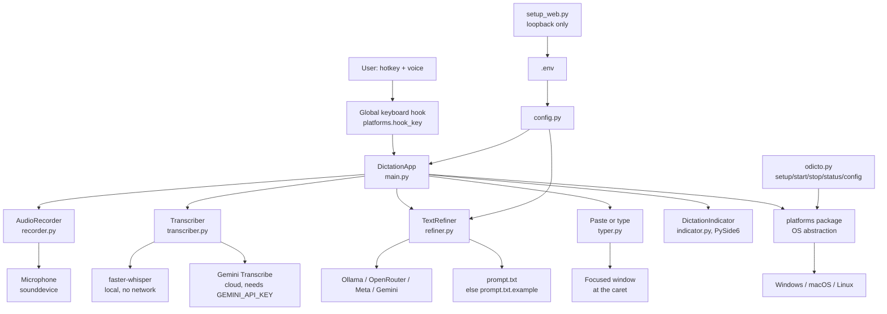
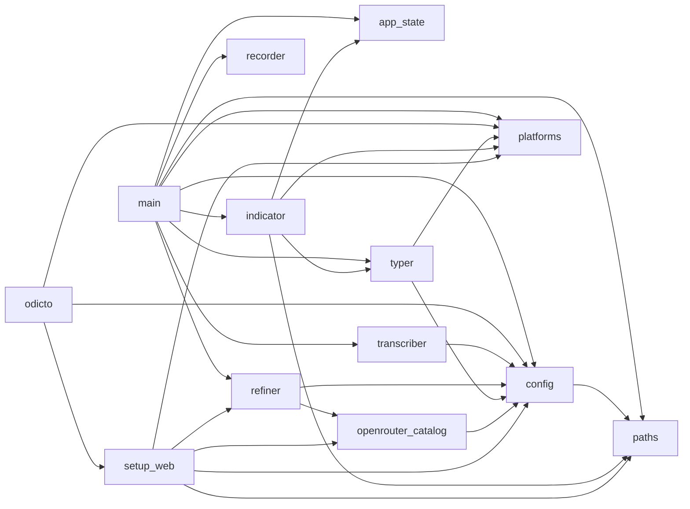
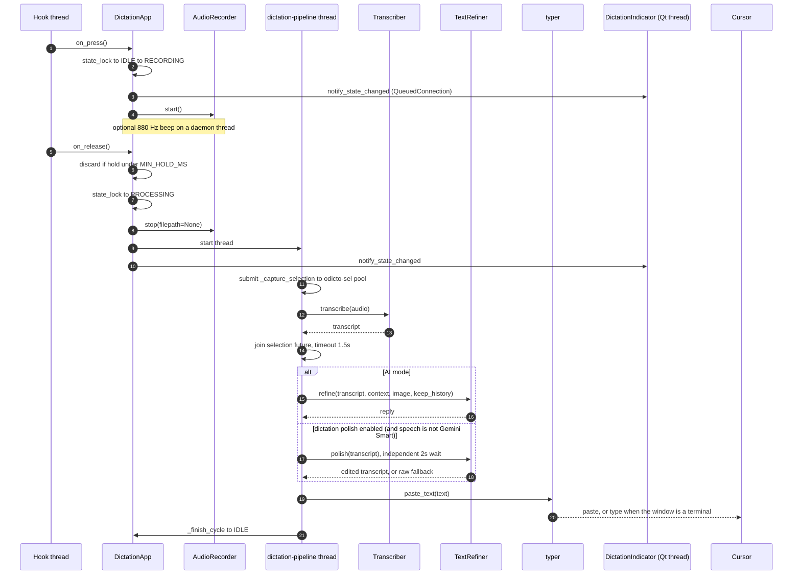
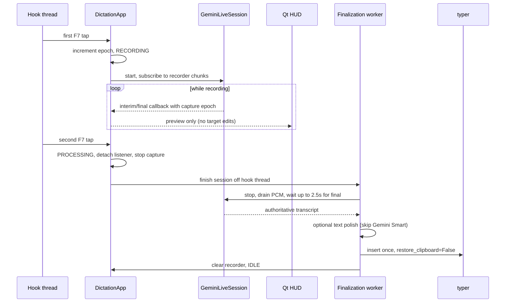
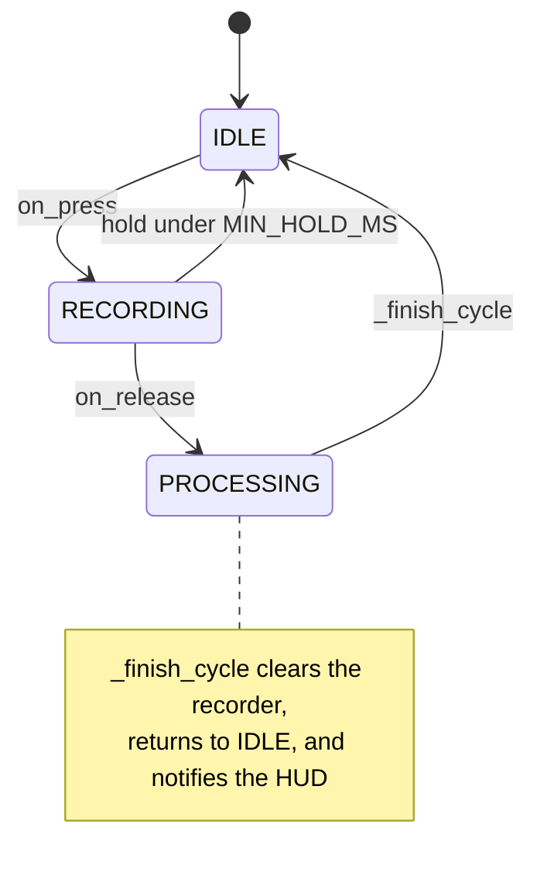
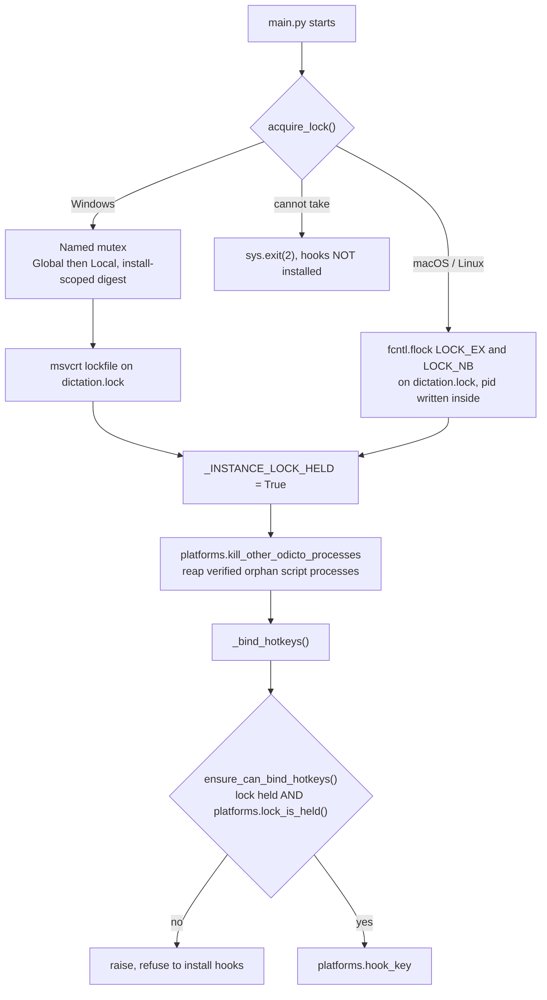
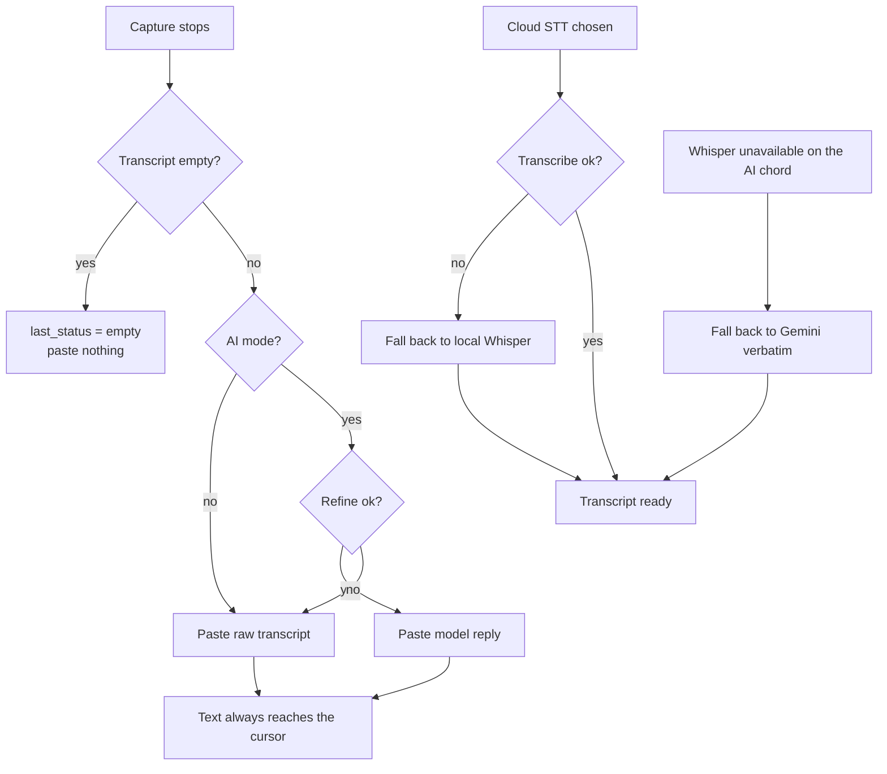

# Odicto — Architecture

**This file is the canonical architecture reference.** `README.md` and `AGENTS.md` link here
rather than repeating it. If you are an agent or a new contributor, read this first, then
[engineering-notes.md](./engineering-notes.md) for why things are shaped this way.

Odicto is a **push-to-talk dictation tool with optional AI reframing**. You hold (or tap) a
global hotkey, speak, release, and the text is pasted at your cursor. With a second hotkey the
transcript is first sent to an LLM as a prompt, and the model's reply is pasted instead.

---

## 1. The 60-second tour

| Question | Answer |
|---|---|
| Entry point | Root `main.py` / `odicto.py` launch the implementations in `app/`; `app/setup_web.py` serves setup |
| How it starts | `start_dictation.bat` / `scripts/posix/run_debug.sh` → `main.py` (pythonw on Windows) |
| Where config comes from | `.env` → `ENV_DEFAULTS` in `config.py` (single source of defaults) |
| How text reaches your cursor | `typer.py` — clipboard paste, or **typing** when the target is a terminal |
| Speech to text | `transcriber.py` — local Whisper, or cloud Gemini, Groq, or OpenRouter |
| Optional LLM | `refiner.py` — `none` / `ollama` / `openrouter` / `meta` / `gemini` / `groq` |
| Audio capture | `recorder.py` — a persistent `sounddevice` stream + 0.4 s pre-roll |
| The bit that bites you | a **global keyboard hook with suppression**, hence the single-instance lock |

**How to run it locally**

```bash
.\scripts\windows\run_debug.bat            # Windows: foreground, console logging
bash scripts/posix/run_debug.sh             # macOS / Linux
.\scripts\windows\setup.bat                # configure a provider + API key in a web form
.venv\Scripts\python.exe odicto.py config   # show every resolved value and its source
```

---


## Project folders

```text
app/                Application modules and platforms/ OS backends
assets/             Setup page HTML, CSS, and JavaScript
tests/              Unit, reliability, equivalence, and layout tests
scripts/windows/    Windows setup, debug, stop, and startup helpers
scripts/posix/      macOS/Linux setup, debug, stop, and startup helpers
tools/              Verification and architecture tooling
docs/               Architecture, engineering notes, and research
```

The root keeps the README, dependency list, installers, settings templates, and small
`main.py`, `odicto.py`, and `start_dictation.*` launchers. Existing startup shortcuts can
continue to use those entry points. Private `.env` and `prompt.txt`, and ignored runtime
logs, PID, and lock files still belong at the install root. `app/paths.py` resolves that
root independently of the working directory.

Application modules keep their existing import names. The launchers and `tests/__init__.py`
put `app/` on Python's import path; no installation or package build is required.
Run tests from the project root with `python -m unittest discover -s tests -t .`.
The optional microphone diagnostic is `python -m tests.test_pipeline`.

### Runtime recovery and diagnostics

An ordinary start first acquires both ownership locks and exits if another owner
holds them. Only the exclusive owner sweeps orphan processes before binding hooks.
Double-clicking the root Windows `start_dictation.bat` explicitly restarts and
keeps its result window open. `/min` and `/nostartup` remain ordinary starts;
the internal Windows launcher also supports explicit `/restart`.
The launcher waits for a fresh heartbeat from the verified owner and recent
microphone callbacks before reporting ready (`odicto.py wait-ready`). A Windows
virtual environment normally has a launcher PID and a child interpreter PID;
stop output counts processes, not independent app instances. Any failed or
unconfirmed termination cancels restart and retains ownership metadata.
Process matching checks the executed Python script, rather than mentions of
`main.py` inside an agent command. A stale PID file cannot authorize killing an
unverified process. An intentional restart remains an explicit stop followed by
start; debug launchers and setup Save perform that explicit restart.

The microphone reuses one persistent stream during healthy operation. Startup
retains bounded retries for a device that is not ready at login. Windows logs
confirmed a Yeti endpoint disappearing and returning while its old stream stayed
stalled. If callbacks are more than three seconds stale at the next capture,
start closes the old stream before reopening the same device, then waits at most
one second for fresh callbacks. Native stream operations are serialized against
shutdown; an unsuccessful close cannot authorize a second stream. There is no
background reopening or signal-volume trigger. Status reads never alter input.
Healthy hotkeys reuse the stream and pre-roll without opening a device.
Input overflow or a callback gap invalidates an active recording and clears old
pre-roll; resuming callbacks cannot conceal lost audio. Stop rejects the partial
capture and asks the user to record again. Quiet speech remains valid.
Native driver calls cannot be forcibly interrupted within Python; a driver that
hangs during close/open can still require an explicit process restart.
The production keyboard hook only snapshots the chord and enqueues an action;
one daemon worker performs ordered capture actions, including reconnect. Device
work never waits inside the global hook. Start/Stop order and modifier snapshots
survive queued input, and shutdown discards queued work. Both dictation modes
announce recording only after capture starts. Failed starts appear in the HUD.

`python odicto.py status` reads a metadata heartbeat in `dictation-health.json`:
PID, readiness, capture state, microphone closure state and callback age.
Published readiness is false when callbacks are stale or input is closed; the
internal initialized state still permits the next hotkey to reconnect input.
Device name, host API and input peak/RMS are included; last completed capture
duration and RMS survive ordinary pipeline cleanup. These are magnitude
statistics, not recorded audio or a speech-quality verdict. Low volume or silence
never changes the stream. The obsolete status-command-local lock flag is
omitted because it did not describe ownership in the running app. A
PID mismatch or heartbeat older than ten seconds is reported as stale. This
proves monitor liveness, not Qt/hook/provider responsiveness. It contains no
audio, transcript or credentials. Existing running versions need a restart to
publish it. There is no automatic whole-process watchdog: an explicit stop or
Quit must stay stopped, and a timed-out worker must never paste a late result.

Audio status logging runs outside the real-time callback; assembling a finished
capture also runs outside its buffer lock. `tools/verify.ps1` runs clean-config
tests in an isolated source copy, without moving live `.env` or `prompt.txt`.
Test instances explicitly omit runtime PID/heartbeat publication. Shutdown removes
only its own PID while holding the install lock, invalidates live callbacks, and
shares a gate with final text insertion so a late provider result cannot paste
after Quit. Existing insertion finishes before shutdown takes that gate.

Valid empty cloud speech responses remain empty instead of invoking another
recognizer. Exact digital silence bypasses local Whisper decoding; no amplitude
threshold suppresses quiet speech. Gemini unary speech requests use a 15-second
HTTP timeout without SDK retries; Gemini AI requests default to 30 seconds while
preserving the two-second polish timeout. These are HTTP phase/inactivity bounds,
not absolute whole-cycle deadlines including retries or local model loading.

Gemini Live owns a bounded audio queue. Overflow, transport errors or stop timeout
mark the session incomplete: both its final and its HUD preview are discarded in
favor of batch transcription of the complete in-memory recording. On timeout,
the session cancels its async task on its owning loop, with at most 0.5 seconds
additional cleanup. Synchronous native code cannot be forcibly cancelled; a
noncooperative transport remains a limitation rather than being declared stopped.

The verification gate requires clean process exit, complete expected test counts,
expected skips and an exact successful summary. A printed `OK` followed by a
timeout or failing exit no longer counts as a pass. Component-boundary tests also
run in the three-platform CI workflow; local Windows success does not establish
macOS/Linux runtime behavior.

## 2. System context


```mermaid
graph TD
    User["User: hotkey + voice"] --> Hotkey["Global keyboard hook<br/>platforms.hook_key"]
    Hotkey --> App["DictationApp<br/>main.py"]

    App --> Rec["AudioRecorder<br/>recorder.py"]
    Rec --> Mic["Microphone<br/>sounddevice"]
    App --> STT["Transcriber<br/>transcriber.py"]
    STT --> Whisper["faster-whisper<br/>local, no network"]
    STT --> GeminiLive["Gemini Transcribe<br/>cloud, needs GEMINI_API_KEY"]
    App --> Ref["TextRefiner<br/>refiner.py"]
    Ref --> LLMs["Ollama / OpenRouter / Meta / Gemini"]
    Ref --> Prompt["prompt.txt<br/>else prompt.txt.example"]
    App --> Typer["Paste or type<br/>typer.py"]
    Typer --> Cursor["Focused window<br/>at the caret"]
    App --> HUD["DictationIndicator<br/>indicator.py, PySide6"]
    App --> Plat["platforms package<br/>OS abstraction"]
    Plat --> OS["Windows / macOS / Linux"]

    Setup["setup_web.py<br/>loopback only"] --> EnvFile[".env"]
    EnvFile --> Config["config.py"]
    Config --> App
    Config --> Ref
    CLI["odicto.py<br/>setup/start/stop/status/config"] --> Plat
```

---

## 3. Module map

Application source lives in `app/`; root Python files are small launchers.
`assets/setup_template.html` holds the setup page markup that used to be an f-string
inside `setup_web.py`. It renders the "Quiet Console" dashboard: a left rail nav over five
views (Overview status meters, AI, Speech, Controls, Prompt), one form with a sticky
save/test dock, and `__TOKEN__` placeholders filled one-pass by `setup_web._page()`.

| Module | Responsibility | Public API other modules call |
|---|---|---|
| `app/main.py` | Process entry, orchestration, `DictationApp` state machine, hotkey handlers, pipeline | `DictationApp`, `acquire/release_single_instance_lock`, `ensure_can_bind_hotkeys` |
| `app/config.py` | `.env` loading, `ENV_DEFAULTS`, cascade resolvers, validation, hotkey parsing, prompt resolution | `Config`, `ENV_DEFAULTS`, `parse_hold_hotkey`, `validate_hotkey_pair`, `config_warnings`, `prompt_live_path` |
| `app/indicator.py` | PySide6 always-on-top, click-through HUD: glyph, label, chips, waveform, 60 fps ticks | `DictationIndicator`, `GuiState`, `status_label` |
| `app/refiner.py` | LLM clients and the refine call, conversation history, provider ping | `TextRefiner`, `test_provider`, `openrouter_effort_for_model`, `build_system_prompt_with_context` |
| `app/setup_web.py` | Loopback setup page server; reads/writes `.env` and `prompt.txt` atomically | `run_server`, `_page`, `merge_env`, `validate_provider_requirements` |
| `app/transcriber.py` | Whisper, Gemini Live, and batch Groq / OpenRouter speech | `WhisperTranscriber`, `CloudTranscriber`, `GeminiTranscriber`, `GeminiLiveSession`, `float32_to_wav_bytes` |
| `app/typer.py` | Clipboard snapshot/restore, paste chords, terminal typing, selection probe | `paste_text`, `get_selected_text`, `get_clipboard_image` |
| `app/recorder.py` | Persistent capture stream, pre-roll, level/waveform, beeps | `AudioRecorder`, `play_beep` |
| `app/openrouter_catalog.py` | Cached OpenRouter model catalog; reasoning-effort clamping | `ensure_openrouter_catalog`, `clamp_openrouter_effort`, `lightest_openrouter_effort` |
| `app/odicto.py` | Lifecycle CLI (`setup`/`start`/`stop`/`status`/`config`/`autostart`) | `main()` |
| `app/app_state.py` | The shared `AppState` enum, in its own module so `main` and `indicator` compare the *same* class | `AppState` |
| `app/platforms/` | Per-OS keyboard, clipboard, window, lock and process behaviour | see §3.1 |
| `app/paths.py` | Canonical install root; keeps settings and runtime paths stable after moves | `ROOT` |

### 3.1 The platform layer

`app/platforms/__init__.py` picks a backend **once at import** and re-exports it, so `import
platforms` gives one consistent surface on every OS.

| File | Lines | Role |
|---|---|---|
| `app/platforms/__init__.py` | 51 | `sys.platform` dispatch + `__all__` |
| `app/platforms/base.py` | 168 | OS-agnostic: install paths, clipboard, terminal-detection tables and matcher |
| `app/platforms/_keyboard.py` | 481 | Shared `keyboard`-lib backend (Windows + Linux): hooks, key synthesis, SendInput batching |
| `app/platforms/_posix.py` | 228 | Shared POSIX lock (`fcntl.flock`) and process management |
| `app/platforms/windows.py` | 353 | Named mutex + `msvcrt` lockfile, `taskkill` orphan sweep, Win32 exstyles |
| `app/platforms/macos.py` | 352 | `pynput` hooks, `NSWorkspace` terminal detection |
| `app/platforms/linux.py` | 94 | X11 terminal detection via `xdotool`/`xprop`; re-exports the POSIX helpers |

### 3.2 Module dependency graph (generated)

Regenerate with `python tools/module_graph.py --write`; `--check` fails when stale, and
`test_equivalence.py` runs that check.

<!-- BEGIN GENERATED: module-graph (tools/module_graph.py) -->

```mermaid
graph LR
    main --> app_state
    main --> config
    main --> indicator
    main --> paths
    main --> platforms
    main --> recorder
    main --> refiner
    main --> transcriber
    main --> typer
    odicto --> config
    odicto --> platforms
    odicto --> setup_web
    config --> paths
    transcriber --> config
    refiner --> config
    refiner --> openrouter_catalog
    typer --> config
    typer --> platforms
    indicator --> app_state
    indicator --> paths
    indicator --> platforms
    indicator --> typer
    openrouter_catalog --> config
    setup_web --> config
    setup_web --> openrouter_catalog
    setup_web --> paths
    setup_web --> platforms
    setup_web --> refiner
```
<!-- END GENERATED: module-graph -->

Two things worth noticing: `config` is imported by nearly everything (it is the only place
defaults live), and `platforms` is imported by `typer` and `indicator` as well as `main` —
which is why the platform `__all__` lists must cover their needs too, not just `main`'s.

---

## 4. The critical path: hold the hotkey, speak, release


```mermaid
sequenceDiagram
    autonumber
    participant Hook as Hook thread
    participant App as DictationApp
    participant Rec as AudioRecorder
    participant Pipe as dictation-pipeline thread
    participant STT as Transcriber
    participant LLM as TextRefiner
    participant Typ as typer
    participant HUD as DictationIndicator (Qt thread)

    Hook->>App: on_press()
    App->>App: state_lock to IDLE to RECORDING
    App->>HUD: notify_state_changed (QueuedConnection)
    App->>Rec: start()
    Note over App,Rec: optional 880 Hz beep on a daemon thread

    Hook->>App: on_release()
    App->>App: discard if hold under MIN_HOLD_MS
    App->>App: state_lock to PROCESSING
    App->>Rec: stop(filepath=None)
    App->>Pipe: start thread
    App->>HUD: notify_state_changed

    Pipe->>Pipe: submit _capture_selection to odicto-sel pool
    Pipe->>STT: transcribe(audio)
    STT-->>Pipe: transcript
    Pipe->>Pipe: join selection future, timeout 1.5s
    alt AI mode
        Pipe->>LLM: refine(transcript, context, image, keep_history)
        LLM-->>Pipe: reply
    else dictation polish enabled (and speech is not Gemini Smart)
        Pipe->>LLM: polish(transcript), independent 2s wait
        LLM-->>Pipe: edited transcript, or raw fallback
    end
    Pipe->>Typ: paste_text(text)
    Typ-->>Cursor: paste, or type when the window is a terminal
    Pipe->>App: _finish_cycle to IDLE
```

The selection/image probe overlaps transcription on purpose: clipboard waits must not delay
STT.

## 5. The live path (F7 tap-to-talk)


```mermaid
sequenceDiagram
    participant Hook as Hook thread
    participant App as DictationApp
    participant Sess as GeminiLiveSession
    participant HUD as Qt HUD
    participant Pipe as Finalization worker
    participant Typ as typer
    Hook->>App: first F7 tap
    App->>App: increment epoch, RECORDING
    App->>Sess: start, subscribe to recorder chunks
    loop while recording
        Sess-->>App: interim/final callback with capture epoch
        App-->>HUD: preview only (no target edits)
    end
    Hook->>App: second F7 tap
    App->>App: PROCESSING, detach listener, stop capture
    App->>Pipe: finish session off hook thread
    Pipe->>Sess: stop, drain PCM, wait up to 2.5s for final
    Sess-->>Pipe: authoritative transcript
    Pipe->>Pipe: optional text polish (skip Gemini Smart)
    Pipe->>Typ: insert once, restore_clipboard=False
    Pipe->>App: clear recorder, IDLE
```

Only Gemini uses the streaming session; other F7 providers batch-transcribe once on stop.
Explicit `LIVE_STT_PROVIDER` choices are honored and lazily cached independently of the
ordinary speech provider. A Gemini final or an available draft skips batch STT. Only an
empty Live result falls back to the selected speech engine. Callbacks from an old capture
are ignored by epoch; no callback or background cleanup edits the target field.

F7 stays PROCESSING through finalization, polish and insertion, so both hotkeys reject a
new capture until completion. Preview text and committed fragments belong to that capture:
clear them on ordinary capture start and at every pipeline exit before returning to IDLE.
In non-terminals its final text stays on the clipboard for
asynchronous paste consumers. Terminals still receive typed Unicode without a clipboard
change. The deleted caret worker, tail backspacing and delayed F7 clipboard restoration
must not be reintroduced.

`POLISH_DICTATION=false` is the default. When enabled, raw dictation uses the selected AI
provider with `POLISH_MODEL` or its selected chat model, a fixed editing prompt, and no
selection, image, reset commands or history. A separate worker waits at most two seconds;
at most one polish call can be outstanding. Timeout, empty/truncated chat output or failure
keeps raw text and shows "Polish skipped · raw text". Gemini Smart skips duplicate polish.
AI answer failure similarly shows "AI failed · raw text" instead of "Done". Screenshot
context requires explicit `AI_CLIPBOARD_IMAGE=true`; the HUD marshals Qt image access to
the GUI thread. Remote AI providers do not generate a startup warmup reply; Ollama does.

## 6. Application and HUD states


```mermaid
stateDiagram-v2
    [*] --> IDLE
    IDLE --> RECORDING: on_press
    RECORDING --> PROCESSING: on_release
    PROCESSING --> IDLE: _finish_cycle
    RECORDING --> IDLE: hold under MIN_HOLD_MS
    note right of PROCESSING
        _finish_cycle clears the recorder,
        returns to IDLE, and notifies the HUD
    end note
```

`AppState` (main) drives `GuiState` (indicator). The HUD polls the app on a 60 fps tick and
maps state plus `last_status` into `BOOTING / RECORDING / PROCESSING / SUCCESS / ERROR /
RESET / HIDDEN`. Auto-hide timers: 1.2 s on success, 1.5 s on error.

## 7. Single instance — the invariant that keeps typing sane

While Odicto runs, **every keypress in every app** passes through its global hook. Two
instances means two hooks and doubled characters (`tthhiiss`). Three gates enforce one
instance:


```mermaid
graph TD
    Start["main.py starts"] --> Lock{"acquire_lock()"}
    Lock -->|Windows| Mutex["Named mutex<br/>Global then Local, install-scoped digest"]
    Mutex --> LockFile["msvcrt lockfile on dictation.lock"]
    Lock -->|macOS / Linux| Flock["fcntl.flock LOCK_EX and LOCK_NB<br/>on dictation.lock, pid written inside"]
    LockFile --> Held["_INSTANCE_LOCK_HELD = True"]
    Flock --> Held
    Lock -->|cannot take| Exit["sys.exit(2), hooks NOT installed"]
    Held --> Kill["platforms.kill_other_odicto_processes<br/>reap verified orphan script processes"]
    Kill --> Bind["_bind_hotkeys()"]
    Bind --> Gate{"ensure_can_bind_hotkeys()<br/>lock held AND platforms.lock_is_held()"}
    Gate -->|no| NoHooks["raise, refuse to install hooks"]
    Gate -->|yes| Hooks["platforms.hook_key"]
```

**Never install hooks without the lock.** On Windows the same install-scoped name is used,
so a second copy in the same folder collides while a second *different* install does not.

## 8. Threads and locks

| Thread | Created by | Lives for | Notes |
|---|---|---|---|
| `dictation-init` | `DictationApp.__init__` | start-up only | builds recorder/transcriber/refiner, binds hotkeys |
| `odicto-runtime-health` | `DictationApp` | process lifetime | metadata heartbeat; stops on shutdown |
| hook thread | `platforms.hook_key` | process | invokes `on_press` / `on_release` / `on_live_toggle` |
| `dictation-pipeline` | `on_release` | one cycle | `process_and_paste` |
| `odicto-sel` | `process_and_paste` | one cycle | `ThreadPoolExecutor(max_workers=1)`, shut down in `finally` |
| `odicto-live-stop` / abort worker | live teardown | one task | join the session off the hook thread, then insert once |
| `odicto-polish` | `TextRefiner.polish` | one request | one outstanding worker; caller waits at most 2s |
| `beep-start` / `beep-stop` | `DictationApp._beep` | ~80 ms | never blocks the hot path |
| Qt thread | `indicator.start` | process | all painting; worker threads marshal via signals |

| Lock / primitive | Guards |
|---|---|
| `self.state_lock` | `state`, `_last_cycle_end`, `_record_started_at` |
| `self.state_lock` (live callbacks) | `_live_epoch`, `live_active`, `live_preview`, `_live_committed` |
| `_CLIPBOARD_LOCK` (`typer.py`) | paste and selection probes must not interleave |
| `_history_lock` (`refiner.py`) | `conversation_history` |
| `_polish_lock` (`refiner.py`) | prevents overlapping polish requests after a caller timeout |
| Qt signals `_wake`, `_hide_req`, `_reset_flash`, `_image_request` | worker → Qt thread |

## 9. Failure paths and recovery


```mermaid
graph TD
    Start["Capture stops"] --> Empty{"Transcript empty?"}
    Empty -->|yes| NoSpeech["last_status = empty<br/>paste nothing"]
    Empty -->|no| AI{"AI mode?"}
    AI -->|no| Raw["Paste raw transcript"]
    AI -->|yes| LLMCall{"Refine ok?"}
    LLMCall -->|yes| Reply["Paste model reply"]
    LLMCall -->|no| Raw
    Raw --> Pasted["Text always reaches the cursor"]
    Reply --> Pasted

    CloudSTT["Cloud STT chosen"] --> CloudOK{"Transcribe ok?"}
    CloudOK -->|no| Whisper["Fall back to local Whisper"]
    CloudOK -->|yes| Done["Transcript ready"]
    Whisper --> Done
    WhisperFail["Whisper unavailable on the AI chord"] --> GeminiVerbatim["Fall back to Gemini verbatim"]
    GeminiVerbatim --> Done
```

Every fallback is deliberate: a dictation tool that can lose your words is worse than one that
pastes unimproved words.

## 10. Configuration

### 10.1 Resolution order

Three tiers, highest first. This is a **cascade**, not a merge:

| Tier | Example key | Wins when |
|---|---|---|
| 1. Provider-specific override | `META_MODEL` | the key was non-blank at import, or the class attribute was changed after import (this is how `patch.object(Config, ...)` counts as an override) |
| 2. Generic | `LLM_MODEL`, `LLM_MAX_TOKENS`, `LLM_REASONING_EFFORT` | non-blank |
| 3. Built-in default | `ENV_DEFAULTS` in `config.py` | always |

A **blank value behaves like a commented-out line**: the next tier applies. The override step
is table-driven now (`Config._MODEL_ATTR`, `Config._REASONING_ATTR`, `Config._provider_override`)
so adding a provider is a one-row change.

### 10.2 Provider dispatch

| Provider | LLM client | Credential | Notes |
|---|---|---|---|
| `none` | none | — | raw dictation; Ollama is not started |
| `ollama` | OpenAI-compatible, local | none | `num_ctx` / `num_predict` passed via `extra_body` |
| `openrouter` | OpenAI-compatible | `OPENROUTER_API_KEY` | sends `provider.sort=latency` and `reasoning.effort=none` by default; effort is clamped against the cached model catalog |
| `meta` | `_MetaClient` (Responses API) | `META_API_KEY` | no output cap; effort knob is the only control |
| `gemini` | `_GeminiClient` (Interactions API) | `GEMINI_API_KEY` | ignores `LLM_API_BASE`; has its own endpoint |

STT is **independent of `LLM_PROVIDER`**. The resolved provider and its model are
the same for raw dictation and AI mode. AI mode only adds the LLM on top of that
transcript. `LIVE_STT_PROVIDER=auto` follows the same resolution. An explicit live
value can still override F7.

| `STT_PROVIDER` | Raw dictation and AI chord | F7 when live is `auto` |
|---|---|---|
| `whisper` | local Whisper | local Whisper, batch on release |
| `gemini` | Gemini Transcribe (`smart` or `verbatim`) | Gemini Live |
| `groq` | Groq `GROQ_STT_MODEL` | same model, batch on release |
| `openrouter` | `OPENROUTER_STT_MODEL` (Grok speech models included, by slug) | same model, batch on release |
| `auto` | Gemini when a key is saved, else Whisper | the same resolution |

A cloud call with no key, or any speech error, falls back to local Whisper.
`WHISPER_DEVICE=cuda` loads that fallback (or the active local model) into GPU
memory at startup and runs one silent warmup so the first hotkey is not cold.

### 10.3 Where the defaults live

`ENV_DEFAULTS` at the top of `config.py` is the **single** source of built-in defaults.
`.env.example` must agree with it, key for key, and `prompt.txt.example` must equal
`DEFAULT_SYSTEM_PROMPT` byte for byte. `test_units.TestEnvExampleParity` fails otherwise.

Groups: providers and models, hotkeys and timing, audio capture, Whisper, Gemini Transcribe,
terminal handling, prompt files, setup page port. Run
`.venv\Scripts\python.exe odicto.py config` for every resolved value **and the `.env` key that
supplied it**.

## 11. The OS surface

| OS | Hooks | Clipboard | Terminal detection | Lock | Process sweep |
|---|---|---|---|---|---|
| Windows | `keyboard` lib + Win32 `SendInput` | `pyperclip`, `WM_COPY` | window class + process image name | named mutex + `msvcrt` lockfile | `taskkill`, then `tasklist` until gone |
| macOS | `pynput` with `darwin_intercept` | `pyperclip` | `NSWorkspace` bundle id | `fcntl.flock` | `psutil`, then `os.kill` |
| Linux | `keyboard` lib with suppression | `pyperclip` / `xclip` | `xdotool` / `xprop` (X11 only; Wayland returns False) | `fcntl.flock` | `psutil`, then `os.killpg` |

Subprocesses spawned: `tasklist` / `taskkill` (Windows), `xdotool` / `xprop` (Linux), `ollama
serve` (only when `LLM_PROVIDER=ollama`), plus `powershell` from the start scripts.

## 12. Where do I change X?

| I want to… | Change |
|---|---|
| add an LLM provider | `app/config.py` (`ENV_DEFAULTS` + one row in `_MODEL_ATTR`), `app/refiner.py` (`TextRefiner.__init__` + `refine` + `test_provider`), `app/setup_web.py` (`EDITABLE_KEYS`, the page, `validate_provider_requirements`), `.env.example` |
| add a speech provider | `app/config.py` (`ENV_DEFAULTS`, `normalize_stt_provider`, `effective_stt_provider`), `app/transcriber.py`, `main.initialize_app`, `app/setup_web.py`, `assets/setup_template.html`, `.env.example` |
| add a hotkey | `ENV_DEFAULTS`, `config.validate_hotkey_pair`, `main._match_active_chord` and `_bind_hotkeys` |
| change the HUD look | `app/indicator.py` (glyph and chip drawing) — no test covers pixels, so check it by eye |
| change the setup page | `assets/setup_template.html` for markup/CSS/JS; `app/setup_web.py` only for tokens and handlers |
| change what the AI is told | `prompt.txt` (private, gitignored); the shipped default is `prompt.txt.example` **and** `DEFAULT_SYSTEM_PROMPT` — keep both in sync |
| change paste behaviour | `typer.paste_text` and the clipboard helpers |
| add a per-OS behaviour | `app/platforms/base.py` if OS-agnostic, otherwise the backend, and add the name to that backend's `__all__` |

## 13. Invariants — do not break these

1. **One instance, one hook.** Never install global hooks unless the single-instance lock is
   held (`main.ensure_can_bind_hotkeys`). Double letters while typing almost always means two
   instances; stop all, confirm no `main.py` remains, start once.
2. **Dictation never fails.** Every STT and LLM error path must fall back to pasteable text.
3. **`ENV_DEFAULTS` is the only place defaults live.** `.env.example` mirrors it;
   `test_units.TestEnvExampleParity` enforces that both directions.
4. **`prompt.txt.example` == `DEFAULT_SYSTEM_PROMPT`** byte for byte.
5. **`_IMPORT_SNAPSHOT` membership is part of the behaviour contract.** Adding or removing a name
   changes when a `patch.object(Config, ...)` counts as an override.
6. **Blank means unset.** A blank value must fall through to the next cascade tier.
7. **`.env` is the only secret store** and is written `0600` on POSIX. Never log key material;
   `Config.explain()` and the setup page mask it.
8. **`test_units.py` is the equivalence oracle.** Read it to learn the behaviour contract; do not
   weaken it to make a change pass.
9. **Terminal targets are typed into, not pasted into.** No paste chord is dependable there and
   `Ctrl+C` is SIGINT.
10. **Session-scoped runtime files** (`dictation.lock`, `dictation.pid`, `dictation.log`) live in
    the install root and are gitignored.

## 14. Deliberate trade-offs (read before "improving" this)

These are known, chosen limits — not oversights:

- **Stable entry points and module names.** Implementations live in `app/`, while root
  `main.py` / `odicto.py` launchers preserve startup targets. Tests and application code
  still import by top-level module name so patched globals keep their existing behavior.
- **`main.py` keeps its logging and lock plumbing** even though they look extractable:
  `test_units.py` patches `main._LOG_MAX_BYTES` and `main._INSTANCE_LOCK_HELD`, which only works
  if the *reading* code lives in `main.py`.
- **Provider dispatch is still if/elif** in `refiner.py`, `transcriber.py`, `config.py` and
  `setup_web.py`. A unified `providers/` layer is the largest remaining simplification and is
  deliberately out of scope so far.
- **`transcriber.build_transcriber` and `cuda_is_safe_to_load` were deleted** as dead code;
  `cuda_is_safe_to_load`'s docstring claimed tests used it, and none did.
- **HUD paint has no automated coverage** (no pixel tests — Qt rendering differs per platform),
  so painting changes are verified by eye.
- **`app/platforms/macos.py` and `app/platforms/linux.py` cannot be imported on Windows.** Their only
  real gate is the 3-OS CI job.

## 15. Verification

```powershell
.\tools\verify.ps1        # every gate in one command
```

| Gate | What it proves |
|---|---|
| `tests/test_units.py` hash | the behaviour contract has not been edited |
| `-m unittest tests.test_units` | 153 tests, 0 unexpected skips |
| `-m unittest tests.test_equivalence` | the setup page renders identically to the recorded hashes; cascade resolvers unchanged |
| clean-environment run | the suite also passes with no `.env` present, the way CI runs it |
| `-m unittest tests.test_reliability` | 25 input, HUD, AI, and polish regression tests |
| `-m unittest tests.test_layout` | Entry points and install-root paths work after relocation |
| import smoke test | every top-level module imports |
| backend syntax check | `app/platforms/macos.py` and `app/platforms/linux.py` compile |
| `tools/module_graph.py --check` | the diagram above is not stale |

Plus one manual check that no test can replace: launch with `scripts/windows/run_debug.bat`, confirm the log
shows `Application ready!` and `HUD enabled`, hold the hotkey, watch the pill show **Listening**,
release, and confirm the text lands. Then stop the app and confirm normal typing returns — that
is the single-instance invariant in practice.
